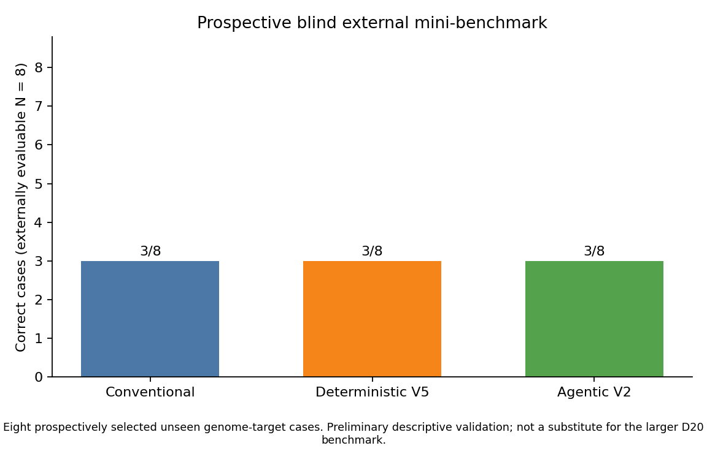
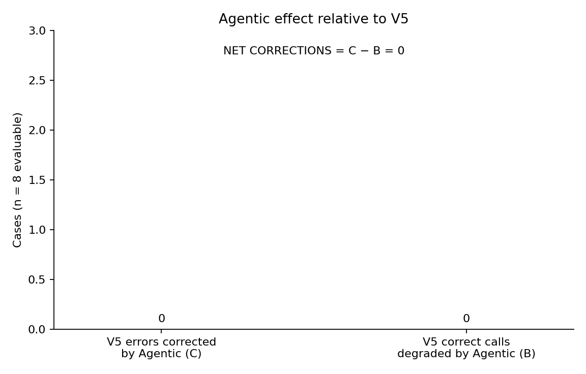

# D8 mini-benchmark external results

Prospective blinded eight-case mini-benchmark (`D8_MINI_EXTERNAL`).
Preliminary descriptive validation; not a substitute for the larger D20 benchmark.
n = 8 is very small. Wilson 95% intervals are descriptive only. No superiority claim is made.

## Lock verification

| File | SHA256 | Result |
|---|---|---|
| `D8_MANIFEST.json` | `37862918643052fa8cb81ff5e180161973a6dd5311aef62bd78c59f8ea74cdbd` | MATCH |
| `D8_CONVENTIONAL_LOCKED.json` | `e2cdb6c91a788f6dd6126ba1bb1ce14aea512e71c110036a66e97e05b4214b51` | MATCH |
| `D8_V5_LOCKED.json` | `0475084d908218c7676820e612745c4e6a309f71b0644642ac08dd8f4b4665db` | MATCH |
| `D8_AGENTIC_V2_LOCKED.json` | `2331e5fd5c265df2046f7fcc1f43dd7ed9e5f51ed4b2c5ecf03b48fc5df63d16` | MATCH |
| `D8_EXTERNAL_TRUTH_LOCKED.json` | `7742562f4dd4bf474998540dfa10ab4d7266994058b58faa658bdfe132b3c9eb` | LOCKED before prediction join |

Confirmed before truth assignment: 8 Conventional, 8 V5, 8 Agentic records.
Agentic position 7 remains `GCF_053618555.1` / `tetA_tetracycline_efflux`, `ok=False`, reason=`planner cited no evidence IDs`. V5 was not substituted for that failure.
D20 was not accessed or modified.

## External truth (independent of predictions)

| Pos | Accession | Target | Endpoint | Truth |
|---:|---|---|---|---|
| 1 | GCF_054792365.1 | rpoB_RNAP_beta | ORTHOLOGOUS_GENE_PRESENCE_ABSENCE | **POSITIVE** |
| 2 | GCF_049373995.1 | rpoB_RNAP_beta | ORTHOLOGOUS_GENE_PRESENCE_ABSENCE | **POSITIVE** |
| 3 | GCF_048851505.1 | tuf_EF_Tu | EXACT_MULTIPLICITY | **1** |
| 4 | GCF_056483745.1 | lacZ_beta_galactosidase | ORTHOLOGOUS_GENE_PRESENCE_ABSENCE | **NEGATIVE** |
| 5 | GCF_046846385.1 | tuf_EF_Tu | EXACT_MULTIPLICITY | **1** |
| 6 | GCF_056267885.1 | lacZ_beta_galactosidase | ORTHOLOGOUS_GENE_PRESENCE_ABSENCE | **NEGATIVE** |
| 7 | GCF_053618555.1 | tetA_tetracycline_efflux | FAMILY_PRESENCE_ABSENCE | **NEGATIVE** |
| 8 | GCF_050310035.1 | tetA_tetracycline_efflux | FAMILY_PRESENCE_ABSENCE | **POSITIVE** |

Truth assignment used NCBI Gene Orthologs where indexed, independent post-lock phmmer of frozen/authentic seeds against each proteome, and NCBI RefSeq/PGAP AMR gene calls (PGAP 6.10; AMRFinderPlus/NCBIfam-AMRFinder) for tet(A)/tet(B) only. tet(C) was not counted. PGAP names were corroboration only.

## Case-level results

| Pos | Accession | Target | Truth | Conventional | Conv correct? | V5 | V5 correct? | Agentic | Agentic correct? | Agentic status |
|---:|---|---|---|---|---|---|---|---|---|---|
| 1 | GCF_054792365.1 | `rpoB_RNAP_beta` | **POSITIVE** | NOT_DETECTED / supported / conf=0.7 | no | DETECTED / weakened / conf=0.55 | yes | DETECTED / supported / conf=0.55 | yes | COMPLETED |
| 2 | GCF_049373995.1 | `rpoB_RNAP_beta` | **POSITIVE** | NOT_DETECTED / supported / conf=0.7 | no | DETECTED / weakened / conf=0.55 | yes | DETECTED / weakened / conf=0.55 | yes | COMPLETED |
| 3 | GCF_048851505.1 | `tuf_EF_Tu` | **1** | NOT_DETECTED / supported / conf=0.7; multiplicity=0 | no | DETECTED / weakened / conf=0.3869; multiplicity=0 | no | EXECUTION_FAILURE (planner cited no evidence IDs) | no | FAILURE |
| 4 | GCF_056483745.1 | `lacZ_beta_galactosidase` | **NEGATIVE** | NOT_DETECTED / supported / conf=0.7 | yes | DETECTED / weakened / conf=0.55 | no | DETECTED / weakened / conf=0.55 | no | COMPLETED |
| 5 | GCF_046846385.1 | `tuf_EF_Tu` | **1** | NOT_DETECTED / supported / conf=0.7; multiplicity=0 | no | NOT_DETECTED / weakened / conf=0.5018; multiplicity=0 | no | NOT_DETECTED / weakened / conf=0.5018; multiplicity=0 | no | COMPLETED |
| 6 | GCF_056267885.1 | `lacZ_beta_galactosidase` | **NEGATIVE** | NOT_DETECTED / supported / conf=0.7 | yes | DETECTED / weakened / conf=0.55 | no | DETECTED / weakened / conf=0.55 | no | COMPLETED |
| 7 | GCF_053618555.1 | `tetA_tetracycline_efflux` | **NEGATIVE** | NOT_DETECTED / supported / conf=0.7 | yes | DETECTED / weakened / conf=0.4341 | no | EXECUTION_FAILURE (planner cited no evidence IDs) | no | FAILURE |
| 8 | GCF_050310035.1 | `tetA_tetracycline_efflux` | **POSITIVE** | NOT_DETECTED / supported / conf=0.7 | no | DETECTED / weakened / conf=0.55 | yes | DETECTED / supported / conf=0.55 | yes | COMPLETED |

tuf cases are scored on exact multiplicity (distinct genuine EF-Tu loci). Conventional has no copy-number field; `not_detected` is scored as multiplicity 0.
Agentic execution failures are incorrect in the primary end-to-end metric when truth is evaluable.

## Primary results

- Externally evaluable: **8 / 8**
- TRUTH_UNCERTAIN: **0**
- Conventional: **3 / 8** (accuracy 0.375; Wilson 95% CI 0.137–0.694)
- Deterministic V5: **3 / 8** (accuracy 0.375; Wilson 95% CI 0.137–0.694)
- Agentic V2 end-to-end: **3 / 8** (accuracy 0.375; Wilson 95% CI 0.137–0.694)
- Agentic completion: **6 / 8**

In this prospective blinded eight-case mini-benchmark, Agentic V2 achieved 3/8 correct compared with 3/8 for V5 and 3/8 for the conventional baseline.

## Paired V5 vs Agentic

- A (both correct) = 3: pos 1, pos 2, pos 8
- B (V5 correct, Agentic incorrect) = 0: none
- C (V5 incorrect, Agentic correct) = 0: none
- D (both incorrect) = 5: pos 3, pos 4, pos 5, pos 6, pos 7

- V5 ERRORS CORRECTED BY AGENTIC = C = **0**
- V5 CORRECT CALLS DEGRADED BY AGENTIC = B = **0**
- NET CORRECTIONS = C − B = **0**

Agentic V2 corrected 0 V5 errors and degraded 0 V5-correct cases.
exact McNemar not applicable (0 discordant pairs); exploratory n=8.

## Mechanistic Agentic results

| Pos | Planner action | Critic action | ActionResult | m_final ≠ m0 | Validator used updated measurements | Final claim | Runtime s | Model calls | Repair | Failure |
|---:|---|---|---|---|---|---|---:|---:|---:|---|
| 1 | `search_target_proteins_mmseqs` | `` | search_target_proteins_mmseqs=INFORMATIVE | yes | yes | Target gene 'rpoB_RNAP_beta' is detected in the current assembly. | 249.619 | 2 | 0 |  |
| 2 | `inspect_contig_edges_for_target` | `` | inspect_contig_edges_for_target=INFORMATIVE | yes | yes | Target gene 'rpoB_RNAP_beta' is detected in the current assembly. | 297.216 | 4 | 0 |  |
| 3 | `inspect_contig_edges_for_target` | `` | {"FAILED": 0, "INFORMATIVE": 0, "NO_NEW_INFORMATION": 0, "UNAVAILABLE": 0} | no | no | Agentic analysis of target 'tuf_EF_Tu' is unresolved because the planner/critic loop fa... | 154.8 | 2 | 0 | planner cited no evidence IDs |
| 4 | `search_target_proteins_mmseqs` | `` | search_target_proteins_mmseqs=INFORMATIVE | yes | yes | Target gene 'lacZ_beta_galactosidase' is detected in the current assembly. | 351.866 | 2 | 0 |  |
| 5 | `inspect_hit_contig_contamination` | `` | inspect_hit_contig_contamination=INFORMATIVE | yes | yes | Target gene 'tuf_EF_Tu' was not detected in the current assembly. | 192.081 | 2 | 0 |  |
| 6 | `search_target_proteins_mmseqs` | `` | search_target_proteins_mmseqs=INFORMATIVE | yes | yes | Target gene 'lacZ_beta_galactosidase' is detected in the current assembly. | 382.691 | 3 | 0 |  |
| 7 | `inspect_contig_edges_for_target` | `` | {"FAILED": 0, "INFORMATIVE": 0, "NO_NEW_INFORMATION": 0, "UNAVAILABLE": 0} | no | no | Agentic analysis of target 'tetA_tetracycline_efflux' is unresolved because the planner... | 154.07 | 2 | 0 | planner cited no evidence IDs |
| 8 | `inspect_contig_edges_for_target` | `` | inspect_contig_edges_for_target=INFORMATIVE | yes | yes | Target gene 'tetA_tetracycline_efflux' is detected in the current assembly. | 199.656 | 2 | 0 |  |

- Informative-action cases: 6 (positions 1, 2, 4, 5, 6, 8)
- No-new-information cases: 0
- Unavailable-action cases: 0
- Planner-selected useful (INFORMATIVE) actions: 6
- Critic-selected useful actions: 0
- Completed cases where Agentic changed V5's final result polarity: 0
- Execution failures (not V5 substitutions): pos 3, pos 7

## Figures

*Figure 1. Prospective blind external mini-benchmark. Eight prospectively selected unseen genome-target cases. Preliminary descriptive validation; not a substitute for the larger D20 benchmark.*

*Figure 2. Agentic effect relative to V5. NET CORRECTIONS = C − B. This panel does not support a 0–100 superiority claim.*

## Interpretation (allowed wording only)

In this prospective blinded eight-case mini-benchmark, Agentic V2 achieved 3/8 correct compared with 3/8 for V5 and 3/8 for the conventional baseline.

Agentic V2 corrected 0 V5 errors and degraded 0 V5-correct cases.

This n=8 mini-benchmark does not establish general genome-wide performance.

